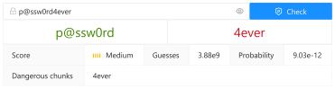

# Chunk-level Password Strength Meter based on BPE_PCFG

## Requirements

- Python3.6 or Python3.8
- Node14.17 and yarn1.22 
- Ubuntu20.04 or Windows 10

## Startup

### Back end

```bash
cd backend
pip3 install -r requirements
python3 pcfg_server.py  # The default ip:port is <device local ip>:3001, and it MUSE BE <device local ip>:3001
```

### Front end

```bash
cd frontend
yarn install
python3 ipconfig.py  # it is the same as: echo <device local ip> > ./src/ip.json
yarn build
yarn global add serve
~/.yarn/bin/serve build  # It will automatically choose a port
```

## Preview


